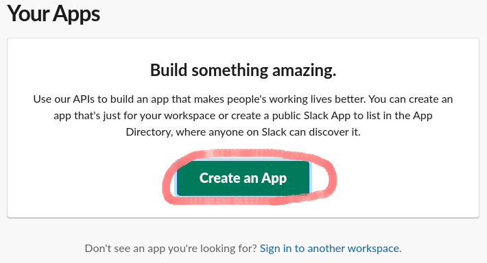

# slack-stock

[](https://oclif.io)
[](https://npmjs.org/package/slack-stock)
[](https://npmjs.org/package/slack-stock)
[](https://github.com/oktntko/slack-stock/blob/master/package.json)

<!-- toc -->

- [slack-stock](#slack-stock)
- [About](#about)
- [Introduction](#introduction)
- [Installation](#installation)
- [add](#add)
- [Commands](#commands)
- [Program Resources](#program-resources)
<!-- tocstop -->

# About

Ever wanted to see your Slack messages in tabular format?  
This app can stock Slack data in your DB (SQLite) with some setup. And you can view the data in various supported formats (Excel, Csv, Tsv, Console).  
And best of all, this app is a command line tool. This means that you can accumulate data on a daily basis by performing scheduled executions (cron for Linux, task manager for Windows). It will make your Slack Life more brilliant.  
Have a great Slack Life with slack-stock!

# Introduction

- stock => view(console)
- cron => stock => after 1 month => view(file)

# Installation

<!-- installation -->

- [`Setup Slack App`](#setup-slack-app)
- [`Install slack-stock`](#install-slack-stock)
  - [`Linux Installation`](#linux-installation)
  - [`Windows Installation`](#windows-installation)

## Setup Slack App

Are you a workspace owner? Otherwise, the procedure will be difficult in the future.
If you want to improve your workspace, ask the owner to empower you.

- [`Create an App`](#create-an-app)
- [`From scratch`](#choose-from-scratch)
- [`Name app & choose workspace`](#name-app--choose-workspace)
- [`OAuth & Permissions`](#oauth--permissions)
- [`User Token Scopes`](#user-token-scopes)
- [`Install to Workspace`](#install-to-workspace)

### Create an App

First of all, create an APP with [Spack App](https://api.slack.com/apps)

<center>



</center>

### Choose From scratch

<center>


</center>

### Name app & choose workspace

Name app, for example "slack-stock".  
If you are the workspace owner, your options will automatically appear.

<center>


</center>

### OAuth & Permissions

<center>


</center>

### User Token Scopes

Add OAuth Scopes, slack-stock needs below scopes.

- channels:history
- channels:read
- groups:history
- groups:read
- team:read
- users:read

<center>


</center>

### Install to Workspace

Install the app in your workspace when you're ready.  
Only Token is issued, and the actual state of the application has not been completed yet.

<center>


</center>

## Install slack-stock

### Linux Installation

```sh-session
$ npm install -g slack-stock
$ slst COMMAND
running command...
$ slst (-v|--version|version)
slack-stock/0.1.0 linux-x64 node-v14.15.3
$ slst --help [COMMAND]
USAGE
  $ slst COMMAND
...
```

### Windows Installation

- downloads from release page.
<!-- installationstop -->

# add

<!-- add -->

video

<!-- addtop -->

# Commands

<!-- commands -->

- [`slst data [ACTION]`](#slst-data-action)
- [`slst help [COMMAND]`](#slst-help-command)
- [`slst menu`](#slst-menu)
- [`slst messages [ACTION]`](#slst-messages-action)
- [`slst teams [ACTION]`](#slst-teams-action)

## `slst data [ACTION]`

You can fetch & view data(user & channel)

```
USAGE
  $ slst data [ACTION]

OPTIONS
  -h, --help                         show CLI help
  -o, --output=console|csv|tsv|xlsx  Select output format
  -t, --team=team                    Enter team name

ALIASES
  $ slst d
```

_See code: [src/commands/data.ts](https://github.com/oktntko/slack-stock/blob/v0.1.0/src/commands/data.ts)_

## `slst help [COMMAND]`

display help for slst

```
USAGE
  $ slst help [COMMAND]

ARGUMENTS
  COMMAND  command to show help for

OPTIONS
  --all  see all commands in CLI
```

_See code: [@oclif/plugin-help](https://github.com/oclif/plugin-help/blob/v3.2.3/src/commands/help.ts)_

## `slst menu`

Select menu

```
USAGE
  $ slst menu

OPTIONS
  -h, --help  show CLI help

ALIASES
  $ slst
```

_See code: [src/commands/menu.ts](https://github.com/oktntko/slack-stock/blob/v0.1.0/src/commands/menu.ts)_

## `slst messages [ACTION]`

You can stock & view message

```
USAGE
  $ slst messages [ACTION]

OPTIONS
  -c, --channel=channel              Enter channel name
  -d, --day                          If this flag ON, period is from one day ago to now.
  -h, --help                         show CLI help
  -k, --keyword=keyword              Enter timer keyword. ex) --keyword="start" "stop"
  -m, --month                        If this flag ON, period is from one month ago to now.
  -o, --output=console|csv|tsv|xlsx  Select output format
  -p, --period=period                Enter period. ex) --period="YYYY-MM-DD" "YYYY-MM-DD"
  -w, --week                         If this flag ON, period is from one week ago to now.

ALIASES
  $ slst m
  $ slst message
```

_See code: [src/commands/messages.ts](https://github.com/oktntko/slack-stock/blob/v0.1.0/src/commands/messages.ts)_

## `slst teams [ACTION]`

You can add & view team

```
USAGE
  $ slst teams [ACTION]

ARGUMENTS
  ACTION  (add|view) OAuth token installed your workspace

OPTIONS
  -h, --help                         show CLI help
  -t, --output=console|csv|tsv|xlsx  Select output format
  -t, --token=token                  OAuth token installed your workspace

ALIASES
  $ slst t
  $ slst team
```

_See code: [src/commands/teams.ts](https://github.com/oktntko/slack-stock/blob/v0.1.0/src/commands/teams.ts)_

<!-- commandsstop -->

# Program Resources

## Options
